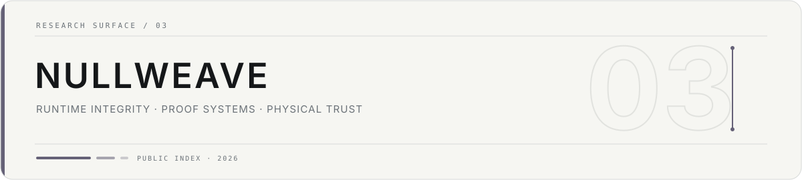

quiet by design · repository names are not implementation claims

**nullweave-lab is a research namespace for runtime integrity, proof systems and physically grounded computing.**

The public surface is intentionally conservative. Several repositories currently define a research or architectural boundary before substantial public implementation exists, so this page does not turn repository names into a feature matrix.

## 01 / current public surfaces

| Repository | Public role |
| --- | --- |
| [android-runtime-integrity-platform](https://github.com/nullweave-lab/android-runtime-integrity-platform) | architecture, roadmap and repository index |
| [parc-spec](https://github.com/nullweave-lab/parc-spec) | protocol / proof-format / interface specification surface |
| [matter-anchored-computing](https://github.com/nullweave-lab/matter-anchored-computing) | research direction for matter-anchored and physically grounded computation |

Other PARC repositories reserve narrower concerns such as proof generation, verification, policy, native probes, rule packs, test infrastructure and service integration. Their existence is **not** treated here as evidence that those components are complete.

## 02 / evidence rule

A capability should appear on this page only after its repository provides enough public code, tests, measurements or published evidence to support the claim.

Until then, the organization page stays an index of research boundaries rather than a roadmap disguised as a product sheet.

scope follows evidence

